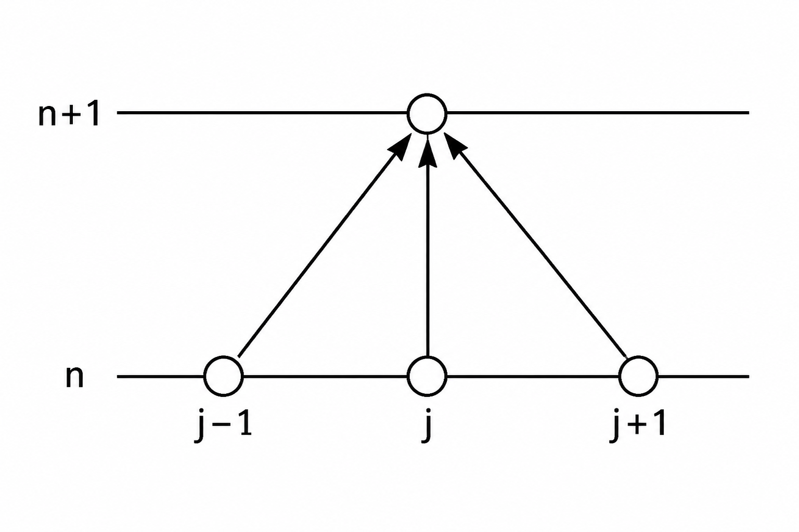

# Explicit FTCS Scheme

To solve the one-dimensional diffusion equation numerically, the continuous partial derivatives must be approximated using discrete finite difference expressions. The Forward-Time Central-Space (FTCS) scheme is the fundamental explicit method used for this purpose.

The governing diffusion equation is evaluated at the grid point $(y_j,t^n)$. Using the spatial index $j$ and the temporal index $n$, one-dimensional diffusion equation can be written in discrete-point notation as:

$$
\left(\frac{\partial u}{\partial t}\right)_j^n=\nu
\left(\frac{\partial^2 u}{\partial y^2}\right)_j^n
$$ {#eq:ftcs-governing-discrete}

The FTCS scheme employs a first-order forward difference in time and a second-order central difference in space.

## A. Discretization of the First-Order Temporal Derivative

To approximate the first-order temporal derivative $\left(\frac{\partial u}{\partial t}\right)_j^n$, a Taylor series expansion of $u(y_j,t^{n+1})$ about the point $(y_j,t^n)$ is used:

$$
u_j^{n+1}=u_j^n + \left(\frac{\partial u}{\partial t}\right)_j^n
\Delta t
+
\frac{1}{2!}
\left(\frac{\partial^2 u}{\partial t^2}\right)_j^n
(\Delta t)^2
+
\frac{1}{3!}
\left(\frac{\partial^3 u}{\partial t^3}\right)_j^n
(\Delta t)^3
+
\cdots
$$ {#eq:ftcs-taylor-time}

Rearranging Equation ([-@eq:ftcs-taylor-time]) to isolate the first-order temporal derivative gives:

$$
\left(\frac{\partial u}{\partial t}\right)_j^n
=
\frac{u_j^{n+1}-u_j^n}{\Delta t}
+
\mathcal{O}(\Delta t)
$$ {#eq:ftcs-forward-time}

The term $\mathcal{O}(\Delta t)$ represents the truncation error of the temporal approximation. Therefore, the forward difference approximation is first-order accurate in time. If the time step $\Delta t$ is reduced by half, the temporal truncation error is also approximately reduced by half.

## B. Discretization of the Second-Order Spatial Derivative

To approximate the second-order spatial derivative $\left(\frac{\partial^2 u}{\partial y^2}\right)_j^n$, the values $u_{j+1}^n$ and $u_{j-1}^n$ are expanded about the point $(y_j,t^n)$.

### Forward Spatial Taylor Expansion

The Taylor series expansion of $u_{j+1}^n$ about the point $(y_j,t^n)$ is:

$$
u_{j+1}^n
=
u_j^n
+
\left(\frac{\partial u}{\partial y}\right)_j^n
\Delta y
+
\frac{1}{2!}
\left(\frac{\partial^2 u}{\partial y^2}\right)_j^n
(\Delta y)^2
+
\frac{1}{3!}
\left(\frac{\partial^3 u}{\partial y^3}\right)_j^n
(\Delta y)^3
+
\frac{1}{4!}
\left(\frac{\partial^4 u}{\partial y^4}\right)_j^n
(\Delta y)^4
+
\cdots
$$ {#eq:ftcs-taylor-space-forward}

### Backward Spatial Taylor Expansion

Similarly, the Taylor series expansion of $u_{j-1}^n$ about the point $(y_j,t^n)$ is:

$$
u_{j-1}^n
=
u_j^n
-
\left(\frac{\partial u}{\partial y}\right)_j^n
\Delta y
+
\frac{1}{2!}
\left(\frac{\partial^2 u}{\partial y^2}\right)_j^n
(\Delta y)^2
-
\frac{1}{3!}
\left(\frac{\partial^3 u}{\partial y^3}\right)_j^n
(\Delta y)^3
+
\frac{1}{4!}
\left(\frac{\partial^4 u}{\partial y^4}\right)_j^n
(\Delta y)^4
-
\cdots
$$ {#eq:ftcs-taylor-space-backward}

Adding Equations ([-@eq:ftcs-taylor-space-forward]) and ([-@eq:ftcs-taylor-space-backward]) eliminates the odd-order spatial derivative terms:

$$
u_{j+1}^n + u_{j-1}^n
=
2u_j^n
+
\left(\frac{\partial^2 u}{\partial y^2}\right)_j^n
(\Delta y)^2
+
\frac{1}{12}
\left(\frac{\partial^4 u}{\partial y^4}\right)_j^n
(\Delta y)^4
+
\cdots
$$ {#eq:ftcs-taylor-space-sum}

The fourth-order and higher-order terms can be included in the truncation error. Therefore, rearranging Equation ([-@eq:ftcs-taylor-space-sum]) to isolate the second-order spatial derivative gives:

$$
\left(\frac{\partial^2 u}{\partial y^2}\right)_j^n
=
\frac{
u_{j+1}^n
-
2u_j^n
+
u_{j-1}^n
}{
(\Delta y)^2
}
+
\mathcal{O}\left((\Delta y)^2\right)
$$ {#eq:ftcs-central-space}

This central difference approximation is second-order accurate in space. Consequently, reducing the grid spacing $\Delta y$ by half reduces the spatial truncation error by approximately a factor of four.

## C. Discrete Algebraic Equation

Substituting the first-order forward difference approximation from Equation ([-@eq:ftcs-forward-time]) and the second-order central difference approximation from Equation ([-@eq:ftcs-central-space]) into the governing diffusion equation in Equation ([-@eq:ftcs-governing-discrete]) yields:

$$
\frac{
u_j^{n+1}
-
u_j^n
}{
\Delta t
}
=
\nu
\left(
\frac{
u_{j+1}^n
-
2u_j^n
+
u_{j-1}^n
}{
(\Delta y)^2
}
\right)
$$ {#eq:ftcs-discrete-substitution}

Multiplying both sides of Equation ([-@eq:ftcs-discrete-substitution]) by $\Delta t$ gives:

$$
u_j^{n+1}
-
u_j^n
=
\frac{\nu\Delta t}{(\Delta y)^2}
\left(
u_{j+1}^n
-
2u_j^n
+
u_{j-1}^n
\right)
$$ {#eq:ftcs-time-multiplication}

Rearranging Equation ([-@eq:ftcs-time-multiplication]) to isolate the unknown value at the new time level, $u_j^{n+1}$, results in:

$$
u_j^{n+1}
=
u_j^n
+
\frac{\nu\Delta t}{(\Delta y)^2}
\left(
u_{j+1}^n
-
2u_j^n
+
u_{j-1}^n
\right)
$$ {#eq:ftcs-rearranged}

The dimensionless diffusion number is defined as:

$$
d
=
\frac{\nu\Delta t}{(\Delta y)^2}
$$ {#eq:ftcs-diffusion-number}

In heat-transfer applications, this parameter is commonly referred to as the Fourier number. Using the diffusion number defined in Equation ([-@eq:ftcs-diffusion-number]), the FTCS update equation becomes:

$$
u_j^{n+1}
=
u_j^n
+
d
\left(
u_{j+1}^n
-
2u_j^n
+
u_{j-1}^n
\right)
$$ {#eq:ftcs-compact-update}

Expanding the terms in Equation ([-@eq:ftcs-compact-update]), the explicit FTCS formulation can also be written as:

$$
u_j^{n+1}
=
d\,u_{j-1}^n
+
(1-2d)\,u_j^n
+
d\,u_{j+1}^n
$$ {#eq:ftcs-weighted-form}

This form clearly shows the contribution of the three neighboring nodes at the previous time level.

The computational molecule, or stencil, for the FTCS scheme is illustrated in Figure [-@fig:ftcs-stencil]. The unknown value at the new time level $n+1$ is explicitly calculated using three known values from the previous time level $n$.

{#fig:ftcs-stencil width=55% fig-pos="H"}

Equation ([-@eq:ftcs-weighted-form]) is an explicit algebraic formulation because the value at the new time level depends only on values that are already known at the previous time level. Therefore, no system of algebraic equations must be solved at each time step.

For a grid containing $N$ nodes, the FTCS update equation is applied at all interior nodes:

$$
j=1,2,\ldots,N-2
$$

The boundary-node values at $j=0$ and $j=N-1$ are assigned directly from the prescribed physical boundary conditions.

$$
\mathcal{T}_{\mathrm{FTCS}}
=
\mathcal{O}(\Delta t)
+
\mathcal{O}\left((\Delta y)^2\right)
$$ {#eq:ftcs-local-truncation-error}

## D. Accuracy of the FTCS Scheme

The temporal and spatial truncation errors obtained from Equations ([-@eq:ftcs-forward-time]) and ([-@eq:ftcs-central-space]) are:

$$
\text{Temporal truncation error}
=
\mathcal{O}(\Delta t)
$$

$$
\text{Spatial truncation error}
=
\mathcal{O}\left((\Delta y)^2\right)
$$

Therefore, the FTCS scheme is:

- first-order accurate in time;
- second-order accurate in space.

The combined local truncation error can be expressed as:

## E. Stability Analysis of the Explicit FTCS Scheme

The explicit FTCS scheme is conditionally stable. This means that the numerical solution remains stable only if the time step $\Delta t$, grid spacing $\Delta y$, and diffusion coefficient $\nu$ satisfy a specific stability condition.

For the one-dimensional diffusion equation, the von Neumann stability analysis gives the following restriction on the diffusion number:

$$
d
=
\frac{\nu\Delta t}{(\Delta y)^2}
\leq
\frac{1}{2}
$$ {#eq:ftcs-stability-criterion}

Equivalently, the stability condition can be written as:

$$
0
\leq
d
\leq
\frac{1}{2}
$$ {#eq:ftcs-stability-amplification}

When $d>\frac{1}{2}$, high-frequency numerical modes are amplified rather than dissipated. As a result, round-off and truncation errors may grow with successive time steps, eventually producing an unstable and non-physical solution.

For a fixed grid spacing $\Delta y$, the maximum permissible time step is obtained from the stability condition in Equation ([-@eq:ftcs-stability-criterion]):

$$
\Delta t_{\max}
=
\frac{(\Delta y)^2}{2\nu}
$$ {#eq:ftcs-maximum-time-step}

In practical implementations, a safety factor is often used. For example, selecting $d=0.45$ instead of the limiting value $d=0.5$ provides a small numerical safety margin:

$$
\Delta t
=
d\frac{(\Delta y)^2}{\nu},
\qquad
d<\frac{1}{2}
$$ {#eq:ftcs-practical-time-step}

Thus, the time step used in the C++ implementation must be selected so that the diffusion number satisfies the FTCS stability restriction in Equation ([-@eq:ftcs-stability-criterion]). If the grid is refined while $\nu$ remains constant, the allowable time step decreases proportionally to $(\Delta y)^2$.
